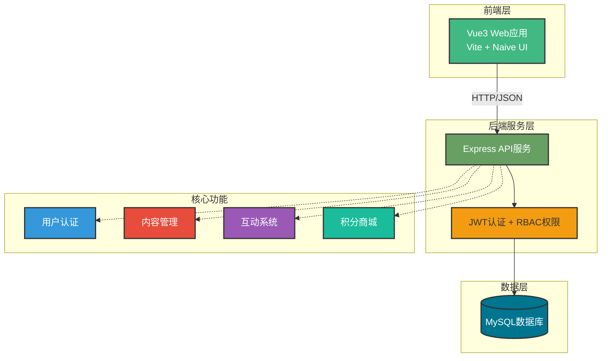

# 文栈博客系统架构图（毕业设计版）

## 系统整体架构图

---

## 使用说明

### 在线预览和导出
1. 访问 https://mermaid.live
2. 复制上述代码粘贴
3. 点击 "Actions" → "PNG" 或 "SVG"
4. 下载后插入到 Word/PDF 文档

### 架构说明

**前端层**：
- Vue3 Web 应用：基于 Vite + Naive UI 构建的单页应用
- 提供博客浏览、后台管理、数据看板等完整功能

**后端服务层**：
- Express API 服务：RESTful 风格的 HTTP 接口
- JWT 认证 + RBAC 权限：身份验证和三级角色权限控制

**数据层**：
- MySQL 数据库：存储用户、文章、评论、积分等业务数据

**核心功能**：
- 用户认证：注册、登录、找回密码、权限管理
- 内容管理：文章发布、分类标签、富文本编辑
- 互动系统：评论审核、点赞收藏、留言板
- 积分商城：积分规则、商品兑换、订单管理

---

## 技术栈

| 层级 | 技术选型 |
|------|----------|
| **前端** | Vue 3 + Vite + Naive UI + Pinia + Vue Router |
| **后端** | Node.js + Express + JWT + bcrypt |
| **数据库** | MySQL 8.0 + mysql2 连接池 |
| **部署** | Nginx + PM2 |

---

## 系统特色

- ✅ 前后端分离架构，职责清晰
- ✅ JWT + RefreshToken 双 Token 认证机制
- ✅ RBAC 三级权限控制（管理员/编辑/普通用户）
- ✅ 积分激励系统，提升用户活跃度
- ✅ 数据看板可视化分析
- ✅ 完整的内容管理与互动能力
